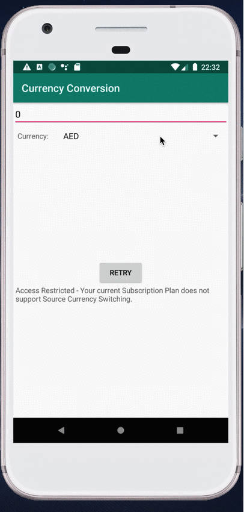

# Demo
This project is created for a code challenge and another purpose is practice how to write Kotlin, AndroidX component and test in an android project.

## Description
Although I have been using Android for many years while writing this app, I haven't written an app that completely in Kotlin and AndroidX, so this app's architecture(MVVM) is [used GithubBrowserSample](https://github.com/googlesamples/android-architecture-components/tree/master/GithubBrowserSample) as refer.

## Functionality
- Able to select a currency from the supported list
- Able to input a number to see all exchange amount
- Retry function when data fetch failed

## Setup
Please get api key from [Currencylayer](https://currencylayer.com/documentation) and add it into local.properties file.
```
currency_layer_key=your_api_key
```

## Screenshot

